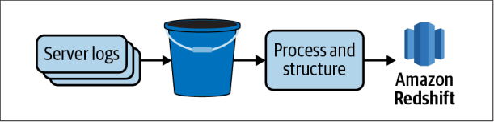

# Chapter 01: 데이터 파이프라인 소개(Introduction to Data Pipelines)

이 책은 데이터 파이프라을 무엇인지 또 구현할 때 아래 같은 사항을 다룬다.

- 일괄 처리 vs 스트리밍 데이터 수집
- 직접 구축 vs 제품을 구매 하는 것
- 일반적인 고려 사항과 주요 걸정 사항

## 데이터 파이프라인이란?(What Are Data Pipelines?)

다양한 소스에서 데이터를 옮기고 변환하는 일련의 과정

로그 -> S3 -> 프로세스 -> RedShift 이동하는 과정

## 누가 파이프라인을 구축할까?(Who Builds Data Pipelines?)

- 데이터 엔지니어가 구축함
- 데이터의 유효성, 적시정을 보장
- 잘못됬을 때 테스트, 경고 및 비상 계획 수립

데이터 엔지니어의 특별한 기술들(The specific skills of a data engineer)

### SQL과 데이터 웨어하우징 기초(SQL and Data Warehousing Fundamentals)

DB 쿼리, 데이터 모델링

### 파이썬 그리고/또는 자바(Python and/or Java)

### 분산컴퓨팅(Distributed Computing)

대용량 데이터를 효율적으로 저장, 처리 및 분석

- 하둡 분산 파일 시스템(HDFS)을 통한 분산 파일 스토리지, 맵리듀스를 통한 처리, 피그(pig)를 통한 데이터 분석
- 아파치 스파크

### 기본 시스템 관리(Basic System Administration)

AWS, Azure, GCP를 통한 파이프라인 배포

### 목표 지향적 사고방식(A Goal-Oriented Mentality)

파이프라인을 구축하는 이유

## 왜 데이터 파이프라인을 구축할까?(Why Build Data Pipelines?)

- 대시보드, 최종 결과물의 뒷단에 파이프라인에서 정리, 정형화, 정규화, 결합, 집계 등을 통해 분석가가 사용할 수 있게 함
- 데이터 분석가와 사이언티스트에게 데이터 제공

## 어떻게 데이터 파이프라인을 구축할까?(How Are Pipelines Built?)

수 많은 툴이 있지만, 이 책은 SQL, Python으로 작성
