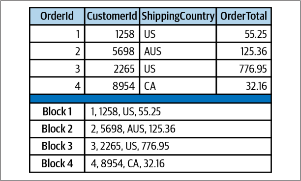
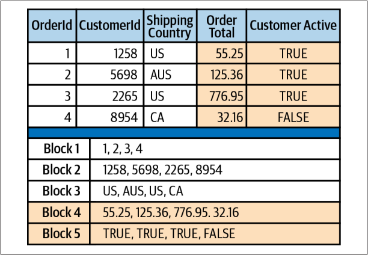
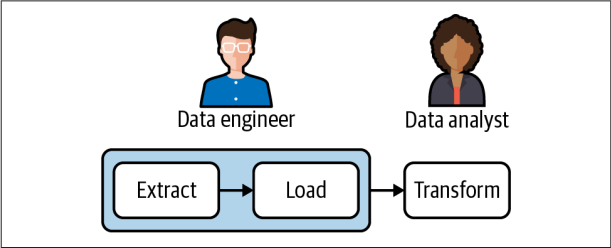

# Chapter 03: 일반적인 데이터 파이프라인 패턴

고수 데이터 엔지니어도 새 데이터 파이프라인은 새롭고 도전과 기회 둘 다 제공함

성공적인 몇 가지 공통 패턴 알아보자

## ETL and ELT

ETL, ELT는 잘 알려진 웨어하우징 및 비지니스 인텔리전스에서 널리 사용된 패턴

둘 다 웨어하우스에 데이터 공급, 분석가나 보고 도구가 유용하게 쓸 수 있게하는 데이터 처리 접근방식

- **추출(Extract)**: 데이터 수집
- **로드(Load)**: 원본 데이터(ELT), 변환된 데이터(ETL)를 웨어하우스, 데이터 레이크, 기타 대상으로 로드
- **변환(Transform)**: 분석가, 시각화 도구, 파이프라인이 제공하기 위해 각 소스 시스템의 원본 데이터와 결합 및 형식 지정

## ETL을 넘어선 ELT의 등장(The Emergence of ELT over ETL)

ELT의 등장 배경

- 방대한 양의 데이터를 로드, 변환하는데 모두 모여있는 필요한 스토리지나 컴퓨팅 자원에 엑세스 가능
- 열 기반 데이터베이스의 등장
- I/O 효율성, 데이터 압축, 데이터 처리 병렬 노드에 데이터 및 쿼리 분산

**행 기반** 데이터베이스, 블록에는 레코드가 포함

- OLTP성 데이터에 적합
- 적은량의 데이터를 읽기 쓰기가 많음(트렌젝션 처리, 예 주문 처리)
- 단일 레코드를 자주 읽고 씀
- 한 번 쿼리의 데이터 양이 적음

**열 기반** 데이터베이스, 쿼리 실행 시 블록에만 엑세스 적용, 압축되어 최적화

- OLAP성 데이터에 적합
- 분석가
- 많은량의 데이터를 읽기 쓰기가 적음(분석 처리, 예 주문 분석)
- 열기반으로 읽어와 특정 컬럼만에 대한 지표와 파생 데이터 이해
- Amazon Redshift, Snowflake 등의 열기반 DB 사용

## EtLT 하위 패턴(EtLT Subpattern)

- EtLT: 추출(E) 후 간단한 변환(t) 후 로드(L) 후 변환(T)
- EtLT의 하위 패턴
  - 테이블에서 레코드 중복 제거
  - URL 파라미터를 개별 구성요소로 구문 분석
  - 민감한 데이터 마스킬 또는 난톡화

## 데이터 분석을 위한 ELT(ELT for Data Analysis)

ELT 는 데이터 분석에 최적의 패턴

데이터 엔지니어와 분석가 간에 책임 명확, 각 역할은 자신에 익숙한 툴과 언어 사용

## 데이터 과학을 위한 ELT(ELT for Data Science)

- 데이터 과학자는 더 세분화된 데이터에 액세스
- 데이터 탐색, 예측 모델 구축
- ELT 패턴의 추출 및 로드 단계가 분석 지원과 거의 동일

## 데이터 제품 및 머신러닝을 위한 ELT(ELT for Data Products and Machine Learning)

데이터 제품 예시

- 넷플릭스 컨텐츠 추천 엔진
- 맞춤 광고 개인화 검색 엔진
- 레스토랑 리뷰 감성 분석

### 머신러닝 파이프 단계(Steps in a Machine Learning Pipeline)

- 비교. 분석용 파이프라인은 변환 단계에서 데이터 모델로 변환을 중점
- 머신러닝 파이프라인은 모델 빌드 및 업데이트
- 데이터 수집, 데이터 전처리, 모델 트레이닝, 모델 배포

### 파이프라인에 피드백 통합(Incorporate Feedback in the Pipeline)

- 모델 개선을 위한 피드백 수집
- 비디오 추천 예시에서 모델별로 클릭율 등 이벤트 수집

### ML 파이프라인에 대한 추가 자료(Further Reading on ML Pipelines)

- 머신러닝 파이프라인 구축(OReilly, 2020)
- 핸즈온 머신러닝(한빛미디어2018)
