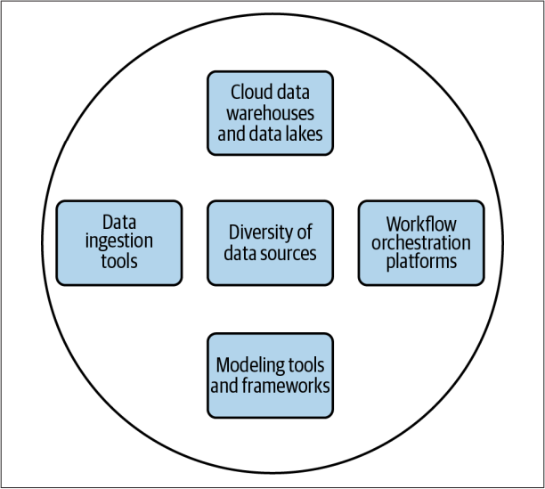
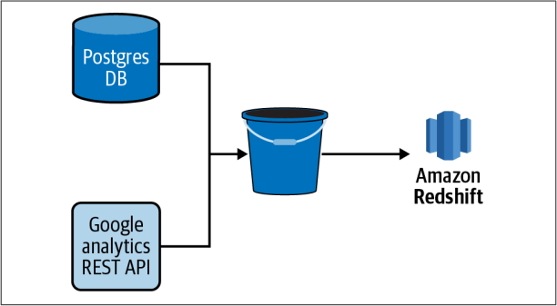
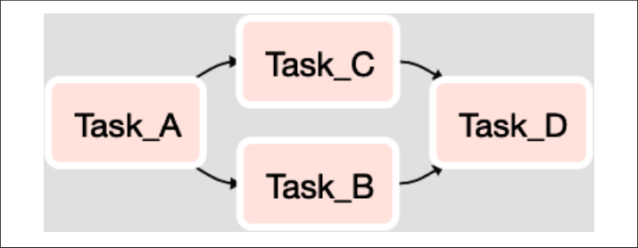
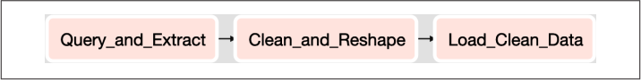
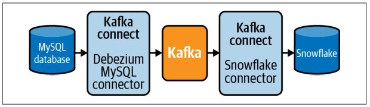

# Table of Contents

- [Table of Contents](#table-of-contents)
- [머릿말(Preface)](#머릿말preface)
  - [이 책의 주요 독자(Who This Book Is For)](#이-책의-주요-독자who-this-book-is-for)
- [Chapter 01: 데이터 파이프라인 소개(Introduction to Data Pipelines)](#chapter-01-데이터-파이프라인-소개introduction-to-data-pipelines)
  - [데이터 파이프라인이란?(What Are Data Pipelines?)](#데이터-파이프라인이란what-are-data-pipelines)
  - [누가 파이프라인을 구축할까?(Who Builds Data Pipelines?)](#누가-파이프라인을-구축할까who-builds-data-pipelines)
    - [SQL과 데이터 웨어하우징 기초(SQL and Data Warehousing Fundamentals)](#sql과-데이터-웨어하우징-기초sql-and-data-warehousing-fundamentals)
    - [파이썬 그리고/또는 자바(Python and/or Java)](#파이썬-그리고또는-자바python-andor-java)
    - [분산컴퓨팅(Distributed Computing)](#분산컴퓨팅distributed-computing)
    - [기본 시스템 관리(Basic System Administration)](#기본-시스템-관리basic-system-administration)
    - [목표 지향적 사고방식(A Goal-Oriented Mentality)](#목표-지향적-사고방식a-goal-oriented-mentality)
  - [왜 데이터 파이프라인을 구축할까?(Why Build Data Pipelines?)](#왜-데이터-파이프라인을-구축할까why-build-data-pipelines)
  - [어떻게 데이터 파이프라인을 구축할까?(How Are Pipelines Built?)](#어떻게-데이터-파이프라인을-구축할까how-are-pipelines-built)
- [Chapter 02: 최신 데이터 인프라(A Modern Data Infrastructure)](#chapter-02-최신-데이터-인프라a-modern-data-infrastructure)
  - [데이터 소스의 다양성(Diversity of Data Sources)](#데이터-소스의-다양성diversity-of-data-sources)
    - [소스 시스템 소유권(Source System Ownership)](#소스-시스템-소유권source-system-ownership)
    - [수집 인터페이스 및 데이터 구조(Ingestion Interface and Data Structure)](#수집-인터페이스-및-데이터-구조ingestion-interface-and-data-structure)
    - [데이터 사이즈(Data Volume)](#데이터-사이즈data-volume)
    - [데이터 클렌징 작업 및 유효성 검사(Data Cleanliness and Validity)](#데이터-클렌징-작업-및-유효성-검사data-cleanliness-and-validity)
    - [소스 시스템의 지연 시간 및 대역폭(Latency and Bandwidth of the Source System)](#소스-시스템의-지연-시간-및-대역폭latency-and-bandwidth-of-the-source-system)
  - [클라우드 데이터 웨어하우스 및 데이터 레이크(Cloud Data Warehouses and Data Lakes)](#클라우드-데이터-웨어하우스-및-데이터-레이크cloud-data-warehouses-and-data-lakes)
  - [데이터 수집 도구(Data Ingestion Tools)](#데이터-수집-도구data-ingestion-tools)
  - [데이터 변환 및 모델링 도구(Data Tramsformation and Modeling Tools)](#데이터-변환-및-모델링-도구data-tramsformation-and-modeling-tools)
  - [워크플로 오케스트레이션 플랫폼(Workflow Orchestration Platforms)](#워크플로-오케스트레이션-플랫폼workflow-orchestration-platforms)
    - [방향성 비순환 그래프(Directed Acyclic Graphs)](#방향성-비순환-그래프directed-acyclic-graphs)
  - [데이터 인프라 커스터마이징(Customizing Your Data Infrastructure)](#데이터-인프라-커스터마이징customizing-your-data-infrastructure)
- [Chapter 03: 일반적인 데이터 파이프라인 패턴](#chapter-03-일반적인-데이터-파이프라인-패턴)
  - [ETL and ELT](#etl-and-elt)
  - [ETL을 넘어선 ELT의 등장(The Emergence of ELT over ETL)](#etl을-넘어선-elt의-등장the-emergence-of-elt-over-etl)
  - [EtLT 하위 패턴(EtLT Subpattern)](#etlt-하위-패턴etlt-subpattern)
  - [데이터 분석을 위한 ELT(ELT for Data Analysis)](#데이터-분석을-위한-eltelt-for-data-analysis)
  - [데이터 과학을 위한 ELT(ELT for Data Science)](#데이터-과학을-위한-eltelt-for-data-science)
  - [데이터 제품 및 머신러닝을 위한 ELT(ELT for Data Products and Machine Learning)](#데이터-제품-및-머신러닝을-위한-eltelt-for-data-products-and-machine-learning)
    - [머신러닝 파이프 단계(Steps in a Machine Learning Pipeline)](#머신러닝-파이프-단계steps-in-a-machine-learning-pipeline)
    - [파이프라인에 피드백 통합(Incorporate Feedback in the Pipeline)](#파이프라인에-피드백-통합incorporate-feedback-in-the-pipeline)
    - [ML 파이프라인에 대한 추가 자료(Further Reading on ML Pipelines)](#ml-파이프라인에-대한-추가-자료further-reading-on-ml-pipelines)
- [Chapter 04: 데이터 수집: 데이터 추출(Data Ingestion: Extracting Data)](#chapter-04-데이터-수집-데이터-추출data-ingestion-extracting-data)
  - [파이썬 환경 설정(Setting Up Your Python Environment)](#파이썬-환경-설정setting-up-your-python-environment)
  - [클라우드 파일 스토리지 설정(Setting Up Cloud File Storage)](#클라우드-파일-스토리지-설정setting-up-cloud-file-storage)
  - [MySQL 데이터베이스에서 데이터 추출(Extracting Data from a MySQL Database)](#mysql-데이터베이스에서-데이터-추출extracting-data-from-a-mysql-database)
    - [전체 또는 증분 MySQL 추출(Full or Incremental MySQL Table Extraction)](#전체-또는-증분-mysql-추출full-or-incremental-mysql-table-extraction)
    - [MySQL 데이터의 이진 로그 복제(Binary Log Replication of MySQL Data)](#mysql-데이터의-이진-로그-복제binary-log-replication-of-mysql-data)
  - [PostgreSQL 데이터베이스에서 데이터 추출(Extracting Data from a PostgreSQL Database)](#postgresql-데이터베이스에서-데이터-추출extracting-data-from-a-postgresql-database)
    - [전체 또는 증분 Postgres 테이블 추출(Full or Incremental Postgres Table Extraction)](#전체-또는-증분-postgres-테이블-추출full-or-incremental-postgres-table-extraction)
    - [Write-Ahead 로그를 사용한 데이터 복제(Replicating Data Using the Write-Ahead Log)](#write-ahead-로그를-사용한-데이터-복제replicating-data-using-the-write-ahead-log)
  - [MongoDB에서 데이터 추출(Extracting Data from MongoDB)](#mongodb에서-데이터-추출extracting-data-from-mongodb)
  - [REST API에서 데이터 추출(Extracting Data from a REST API)](#rest-api에서-데이터-추출extracting-data-from-a-rest-api)
  - [카프카 및 Debezium을 통한 스트리밍 데이터 수집(Streaming Data Ingestions with Kafka and Debezium)](#카프카-및-debezium을-통한-스트리밍-데이터-수집streaming-data-ingestions-with-kafka-and-debezium)
- [Chapter 05: 데이터 수집: 데이터 로드](#chapter-05-데이터-수집-데이터-로드)
- [Chapter 06: 데이터 변환](#chapter-06-데이터-변환)
- [Chapter 07: 파이프라인 오케스트레이션](#chapter-07-파이프라인-오케스트레이션)
- [Chapter 08: 파이프라인 데이터 검증](#chapter-08-파이프라인-데이터-검증)
- [Chapter 09: 파이프라인 유지 관리 모범 사례](#chapter-09-파이프라인-유지-관리-모범-사례)
- [Chapter 10: 파이프라인 성능 측정 및 모니터링](#chapter-10-파이프라인-성능-측정-및-모니터링)

# 머릿말(Preface)

- 파이프라인은 데이터 분석 및 머신러닝의 성공을 위한 기반

## 이 책의 주요 독자(Who This Book Is For)

- 데이터 엔지니어, 기술 리드, 데이터 웨어하우스 엔지니어, 분석 엔지니어
- SQL DB, Rest API, JSON, Script Language(ex. Python), Linux Command, Cloud Computing Platform
- 코드는 Python, SQL, 서버는 AWS가 메인, MS Azure, GCP도 사용 가능하게 코드 작성
- 코드 예제 사이트(한글)[https://github.com/wikibook/dppr](https://github.com/wikibook/dppr)
- 코드 예제 사이트(영어)[https://github.com/jamesdensmore/datapipelinesbook](https://github.com/jamesdensmore/datapipelinesbook)

# Chapter 01: 데이터 파이프라인 소개(Introduction to Data Pipelines)

이 책은 데이터 파이프라을 무엇인지 또 구현할 때 아래 같은 사항을 다룬다.

- 일괄 처리 vs 스트리밍 데이터 수집
- 직접 구축 vs 제품을 구매 하는 것
- 일반적인 고려 사항과 주요 걸정 사항

## 데이터 파이프라인이란?(What Are Data Pipelines?)

다양한 소스에서 데이터를 옮기고 변환하는 일련의 과정


로그 -> S3 -> 프로세스 -> RedShift 이동하는 과정

## 누가 파이프라인을 구축할까?(Who Builds Data Pipelines?)

- 데이터 엔지니어가 구축함
- 데이터의 유효성, 적시정을 보장
- 잘못됬을 때 테스트, 경고 및 비상 계획 수립

데이터 엔지니어의 특별한 기술들(The specific skills of a data engineer)

### SQL과 데이터 웨어하우징 기초(SQL and Data Warehousing Fundamentals)

DB 쿼리, 데이터 모델링

### 파이썬 그리고/또는 자바(Python and/or Java)

### 분산컴퓨팅(Distributed Computing)

대용량 데이터를 효율적으로 저장, 처리 및 분석

- 하둡 분산 파일 시스템(HDFS)을 통한 분산 파일 스토리지, 맵리듀스를 통한 처리, 피그(pig)를 통한 데이터 분석
- 아파치 스파크

### 기본 시스템 관리(Basic System Administration)

AWS, Azure, GCP를 통한 파이프라인 배포

### 목표 지향적 사고방식(A Goal-Oriented Mentality)

파이프라인을 구축하는 이유

## 왜 데이터 파이프라인을 구축할까?(Why Build Data Pipelines?)

- 대시보드, 최종 결과물의 뒷단에 파이프라인에서 정리, 정형화, 정규화, 결합, 집계 등을 통해 분석가가 사용할 수 있게 함
- 데이터 분석가와 사이언티스트에게 데이터 제공

## 어떻게 데이터 파이프라인을 구축할까?(How Are Pipelines Built?)

수 많은 툴이 있지만, 이 책은 SQL, Python으로 작성

# Chapter 02: 최신 데이터 인프라(A Modern Data Infrastructure)

파이프라인 구축 전 최신 데이터 스택을 이해해야 함

## 데이터 소스의 다양성(Diversity of Data Sources)

대부분 조직은 수십개 이상의 데이터 소스가 있으며 이를 통해 분석 작업을 함



최신 데이터 인프라의 핵심 구성 요소

- 데이터 수집 도구(Data ingestion tools)
- 클라우드 데이터 웨어하우스와 데이터 레이크(Cloud data warehouses and datalakes)
- 데이터 소스의 다양성(Diversity of data sources)
- 모델링 도구 및 프레임워크(Modeling tools and frameworks)
- 워크플로우 오케스트레이션 플랫폼(Workflow orchestration platforms)

### 소스 시스템 소유권(Source System Ownership)

분석 팀은 내부와 외부로부터 데이터를 수집함



여러 소스(Postgres DB, REST API)의 데이터 -> S3 버킷 -> Redshift 로드

소스의 원천을 이해하는 것이 중요

- 타사 데이터 엑세스 접근 제한(API 접근 가능, SQL 접근 불가)
- 내부에 구축한 시스템은 더 많은 기회를 제공
  - 하지만 데이터 수집을 고려하여 설계했는지는 또 다른 문제
  - 수집은 시스템에 의도하지 않은 부하를 가할 수 있음
  - 데이터를 점진적으로 로드할 수 있는지 여부 등 다양한 과제 발생
- 리소스 제한은 외부 업체와 일하는 것과 크게 다르지 않음

### 수집 인터페이스 및 데이터 구조(Ingestion Interface and Data Structure)

데이터 엔지니어는 소스 데이터를 얻는 방법과 형식, 데이터에 대한 인터페이스가 무엇인지 알아야 함

인터페이스

- Postgres 또는 MysSQL 같은 앱 뒤에 있는 DB
- REST API와 같은 시스템 상단의 추상화 계층
- Apache Kafka와 같은 스트림 처리 플랫폼
- CSV 파일이나 플랫한 파일을 포함한 공유 네트워크 파일 시스템(NFS) or 클라우드 스토리지 버킷(S3)
- 데이터 웨어하우스 또는 데이터 레이크
- HDFS 또는 HBase 데이터베이스의 데이터

데이터 구조

- **JSON** from REST API
- **JSON** within columns from MySQL Table
- **Well-structured data** from from MySQL Table
- **Semistructured log data**
- **CSV**, **FWF(fixed-width format)**, and **other flat file** formats
- **JSON** in flat files
- **Stream output** from Kafka

데이터 구조화

1. 정형 데이터

   - 일반적인 앱, 웹 데이터
   - 분석 프로젝트를 위해 수집, 클렌징, 변환 작업 파이프라인 필요

2. 반정형 데이터

   - 키-벨류 형태(JSON), 점점 보편화
   - 데이터 유연성이 높음, 정제 필요

3. 비정형 데이터

   - 이미지, 비디오, 텍스트, HTML안 텍스트
   - CV(Computer Vision), NLP(Natural Language Processing)등 분석 작업에 흔히 사용

### 데이터 사이즈(Data Volume)

- 데이터를 설계할 때 데이터 사이즈를 고려
- 수집할 때 작은 데이터, 큰 데이터 모두 수집
- 대용량, 소용량에 생각하기 보단 스펙트럼(범위) 측면에서 생각

### 데이터 클렌징 작업 및 유효성 검사(Data Cleanliness and Validity)

데이터의 품질도 매우 다양, 데이터의 한계와 결함을 이해하고 파이프라인에서 해결

지저분한 데이터의 특징

- 중복(Duplicate), 모호한(Ambiguous), 고립된(Orphaned), 불안전(Incomplete), 누락(Missing) 레코드
- 텍스트 인코딩 에러(Text encoding errors)
- 일정하지 않은 포맷(Inconsistent formats)
  - 예 010-xxxx-xxxx, 010xxxxxxxx
- 잘못된 분류(Mislabeled) 데이터
- 라벨링안된(Unlabeled) 데이터

이 책에서 다룰 접근 방식

- 최악을 예상하고 최고를 기대(Assume the worst, expect the best)
- 가장 적절한 시스템에서 데이터를 정제하고 검증(Clean and validate data in the system best suited to do so)
  - ELT가 더 morden한 파이프라인 rather than ETL
  - 떄로는 원본 그대로 Data lake에 적재 후 파이프라인에서 정제
- 자주 검증(Validate often)
  - 초기의 유효성 검증은 나중에도 더 해야함

### 소스 시스템의 지연 시간 및 대역폭(Latency and Bandwidth of the Source System)

- 대량의 데이터를 빈번하게 추출하는 일이 많음
- 파이프라인에서 데이터 추출 단계에서 API 속도 제한, 연결 시간 초과, 느린 다운로드 등은 unhappy

## 클라우드 데이터 웨어하우스 및 데이터 레이크(Cloud Data Warehouses and Data Lakes)

3가지 요소(데이터 웨어하우징과 분석의 배경 뒤에 퍼블릭 클라우드가 있음)

1. 데이터 파이프라인, 데이터 레이크, 웨어하우스, 분석 작업의 빌드와 배포가 쉬움
2. 지속적인 클라우드 비용 감소
3. Amazon RedShift, Snowflake, Google Big Query 같은 확장성 뛰어난 columns

## 데이터 수집 도구(Data Ingestion Tools)

최신 데이터 인프라에서 많은 상용 및 오픈 소스 도구 사용

- Singer: ETL 프레임워크, 데이터 추출 및 로드를 위한 표준 제공, 탭, 타겟 구성
- Stitch: ETL 서비스, 다양한 커넥터, 쉬운 인터페이스, 데이터 통합 작업 간소화
- Fivetran: 완전 관리형 데이터 통합 서비스, 데이터 추출 후 데이터 웨어하우스에 로드

이런 툴이 많아도 자체 프레임워크 개발을 하는 이유

- 비용, 직접 구축 선호, 법적 보안적 위험

## 데이터 변환 및 모델링 도구(Data Tramsformation and Modeling Tools)

- 데이터 모델링
- 데이터 변환

데이터 변환 기능(개인 식별 가능 정보(PII)), 수집 프로세스에 적용

분석 및 보고(GUI 방식 vs SQL 방식)

## 워크플로 오케스트레이션 플랫폼(Workflow Orchestration Platforms)

워크플로 오케스트레이션 플랫폼, 워크플로 관리 시스템(WMS), 오케스트레이션 프레임워크, 오케스트레이션 플랫폼

워크플로 오케스트레이션 플랫폼 도입 이유

- 파이프라인의 복잡성과 수 증가
- 스케줄링 및 종속성 해결
- 일반적 플랫폼: Apache Airflow, Luigi, AWS Glue
- 특별한 플랫폼: Kubeflow Pieline, 도커 컨테이너에 구성된 머신러닝 워크플로

### 방향성 비순환 그래프(Directed Acyclic Graphs)

파이프라인 단계 특징

- 방향성(directed), 순서 보장 및 종속적
- 비순환(acyclic), 작업을 돌릴 수 없음

2가지 제약 조건 때문에 **방향성 비순환 그래프(DaGs, Directed Acyclic Graphs)** 로 파이프라인 생성



DAG(Directed Acyclic Graph) 그래프 예시



1. 관계형 DB에서 데이터 쿼리 후 CSV 파일 저장하는 SQL 스크립트 실행
2. CSV 로드 및 정리, 데이터 형 변경하고 싶은 CSV로 데이터 저장
3. CSV를 Snowflake 데이터 웨어하우스로 로드 SQL COPY 명령어 실행

## 데이터 인프라 커스터마이징(Customizing Your Data Infrastructure)

데이터 인프라가 정확히 일치하는 두 조직을 찾기 힘듬, 커스터마이징 필요

제약 조건(비용, 엔지니어링 리소스, 보안 및 법적 리스크 허용 범위), 그에 따른 트레이드오프 이해

# Chapter 03: 일반적인 데이터 파이프라인 패턴

고수 데이터 엔지니어도 새 데이터 파이프라인은 새롭고 도전과 기회 둘 다 제공함

성공적인 몇 가지 공통 패턴 알아보자

## ETL and ELT

ETL, ELT는 잘 알려진 웨어하우징 및 비지니스 인텔리전스에서 널리 사용된 패턴

둘 다 웨어하우스에 데이터 공급, 분석가나 보고 도구가 유용하게 쓸 수 있게하는 데이터 처리 접근방식

- **추출(Extract)**: 데이터 수집
- **로드(Load)**: 원본 데이터(ELT), 변환된 데이터(ETL)를 웨어하우스, 데이터 레이크, 기타 대상으로 로드
- **변환(Transform)**: 분석가, 시각화 도구, 파이프라인이 제공하기 위해 각 소스 시스템의 원본 데이터와 결합 및 형식 지정

## ETL을 넘어선 ELT의 등장(The Emergence of ELT over ETL)

ELT의 등장 배경

- 방대한 양의 데이터를 로드, 변환하는데 모두 모여있는 필요한 스토리지나 컴퓨팅 자원에 엑세스 가능
- 열 기반 데이터베이스의 등장
- I/O 효율성, 데이터 압축, 데이터 처리 병렬 노드에 데이터 및 쿼리 분산


**행 기반** 데이터베이스, 블록에는 레코드가 포함

- OLTP성 데이터에 적합
- 적은량의 데이터를 읽기 쓰기가 많음(트렌젝션 처리, 예 주문 처리)
- 단일 레코드를 자주 읽고 씀
- 한 번 쿼리의 데이터 양이 적음


**열 기반** 데이터베이스, 쿼리 실행 시 블록에만 엑세스 적용, 압축되어 최적화

- OLAP성 데이터에 적합
- 분석가
- 많은량의 데이터를 읽기 쓰기가 적음(분석 처리, 예 주문 분석)
- 열기반으로 읽어와 특정 컬럼만에 대한 지표와 파생 데이터 이해
- Amazon Redshift, Snowflake 등의 열기반 DB 사용

## EtLT 하위 패턴(EtLT Subpattern)

- EtLT: 추출(E) 후 간단한 변환(t) 후 로드(L) 후 변환(T)
- EtLT의 하위 패턴
  - 테이블에서 레코드 중복 제거
  - URL 파라미터를 개별 구성요소로 구문 분석
  - 민감한 데이터 마스킬 또는 난톡화

## 데이터 분석을 위한 ELT(ELT for Data Analysis)

ELT 는 데이터 분석에 최적의 패턴


데이터 엔지니어와 분석가 간에 책임 명확, 각 역할은 자신에 익숙한 툴과 언어 사용

## 데이터 과학을 위한 ELT(ELT for Data Science)

- 데이터 과학자는 더 세분화된 데이터에 액세스
- 데이터 탐색, 예측 모델 구축
- ELT 패턴의 추출 및 로드 단계가 분석 지원과 거의 동일

## 데이터 제품 및 머신러닝을 위한 ELT(ELT for Data Products and Machine Learning)

데이터 제품 예시

- 넷플릭스 컨텐츠 추천 엔진
- 맞춤 광고 개인화 검색 엔진
- 레스토랑 리뷰 감성 분석

### 머신러닝 파이프 단계(Steps in a Machine Learning Pipeline)

- 비교. 분석용 파이프라인은 변환 단계에서 데이터 모델로 변환을 중점
- 머신러닝 파이프라인은 모델 빌드 및 업데이트
- 데이터 수집, 데이터 전처리, 모델 트레이닝, 모델 배포

### 파이프라인에 피드백 통합(Incorporate Feedback in the Pipeline)

- 모델 개선을 위한 피드백 수집
- 비디오 추천 예시에서 모델별로 클릭율 등 이벤트 수집

### ML 파이프라인에 대한 추가 자료(Further Reading on ML Pipelines)

- 머신러닝 파이프라인 구축(OReilly, 2020)
- 핸즈온 머신러닝(한빛미디어2018)

# Chapter 04: 데이터 수집: 데이터 추출(Data Ingestion: Extracting Data)

- 데이터 수집(Ingestion): 데이터 추출(Extract) + 데이터 로드(Load)
- 일반적인 시스템(공통 시스템)으로 내보내고 가져오기를 4장 5장에서 샘플코드로 연습

## 파이썬 환경 설정(Setting Up Your Python Environment)

`virtualenv`를 사용해 가상환경 만들기

```bash
# 1. 명령어
python -m venv venv

# 2. 실행하기
source venv/Scripts/activate

# 3. 실행 중인지 확인하기
which python

# 4. 종료하기
deactivate
```

[참고] 실행하기 코드가 길어서 `activate` 명령어로 실행하기

```bash
# 1. bashrc 로 들어가기
vi ~/.bashrc

# 2. alias 설정하고 저장하기(Windows와 Linux에 맞게)
alias activate="source venv/Scripts/activate"  # Windows
alias activate="source venv/bin/activate"  # Linux
```

파이썬 패키지 설치하기

```bash
# 1. configparser 설치하기
pip install configparser
```

파이썬 환경설정 파일 생성하기

```bash
touch pipeline.conf
```

❗주의 깃허브 등에 절대 올리면 안되니 `.gitignore`에 `*.conf` 등록하기

## 클라우드 파일 스토리지 설정(Setting Up Cloud File Storage)

클라우드 파일 스토리지는 S3(Amazon Simple Storage Service)로 실습

1. S3 버킷 생성
   - IAM 에서 액세스 관리 정책 설정
   - 비공개로 유지, 기본 설정대로 진행

2. 파이썬 라이브러리 `Boto3` 설치

    명령어 창에서

    ```bash
    # boto3 설치하기
    pip install boto3
    ```

    파이썬 코드에서

    ```python
    # boto3 불러오기
    import boto3
    ```

3. `pipeline.conf` 파일에서 중요한 정보 저장하기

## MySQL 데이터베이스에서 데이터 추출(Extracting Data from a MySQL Database)

MySQL DB에서 2가지 방식으로 추출할 수 있음

- SQL 사용
  - 간단함, 전체, 또는 증가부분 추출
  - 자주 변경되는 대규모 데이터에서는 확장성 떨어짐
- Binary Log 복제
  - 복잡함
  - 원본 테이블 변경되는 데이터 볼륨이 크거나, 소스에서 데이터를 더 자주 수집
  - 스트리밍 데이터 수집, '배치 vs 스트리밍 수집' 섹션 참고

MySQL은 로컬에 설치하거나 Amazon RDS 사용

아래 코드로 `Orders` 테이블 생성 및 SQL 사용법을 익힘

```sql
CREATE TABLE Orders (
 OrderId int,
 OrderStatus varchar(30),
 LastUpdated timestamp
);
INSERT INTO Orders
 VALUES(1,'Backordered', '2020-06-01 12:00:00');
INSERT INTO Orders
 VALUES(1,'Shipped', '2020-06-09 12:00:25');
INSERT INTO Orders
 VALUES(2,'Shipped', '2020-07-11 3:05:00');
INSERT INTO Orders
 VALUES(1,'Shipped', '2020-06-09 11:50:00');
INSERT INTO Orders
 VALUES(3,'Shipped', '2020-07-12 12:00:00');
```

### 전체 또는 증분 MySQL 추출(Full or Incremental MySQL Table Extraction)

전체 증분(Full Extraction)

- 정의: 추출 작업이 실행될 때마다 테이블 모든 레코드 추출
- 특징: 단순, 대용량에서 느림

```sql
-- 전체 추출
SELECT *
  FROM Orders;
```

증분 추출(Incremental Extraction)

- 정의: 이전에 작업을 실행한 시점 이후에 변경되었거나 새로 추가된 레코드만 추출
- 특징: 시간 정보 저장, 대용량에서 빠름

```sql
-- 증분 추출
SELECT *
  FROM Orders
 WHERE LastUpdated > {{ last_extraction_run }};
```

NOTE: `immutable data`(변경불가 데이터)가 포함된 테이블에서는 `LastUpdated` 컬럼이 생성시간으로 사용됨

`{{ last_extraction_run }}` 의미

- 추출 작업이 마지막으로 실행된 시점을 나타내는 타임스탬프
- 아래 방법으로 조회함

```sql
SELECT MAX(LastUpdated)
  FROM warehouse.Orders;
```

TIP: 마지막으로 업데이트된 날짜 캐시(Caching Last Updated Dates)

- 여기서 Orders 테이블이 너무 클 경우 아래 방식
- 마지막으로 업데이트된 레코드의 값을 로그 테이블 등에 저장
- 작업이 시작되거나 끝난 시각을 저장하는 것이 아니라, 데이터 웨어하우스의 대상 테이블에서 실제로 MAX(LastUpdated) 값을 저장해야 함
- 위 처럼 안하면 누락(missed)하거나 중복(duplicated) 위험이 있음

증분 추출의 단점

- 삭제된(deleted) 행 파악이 어려움
- 신뢰할 수 있는 타임스탬프 필요, LastUpdated 컬럼이 없거나 값 누락으로 부정확할 수 있음

데이터 로드 단계에서는 증분 추출과 원본 데이터 둘다 가지면 분석 할 때 유용

### MySQL 데이터의 이진 로그 복제(Binary Log Replication of MySQL Data)

## PostgreSQL 데이터베이스에서 데이터 추출(Extracting Data from a PostgreSQL Database)

### 전체 또는 증분 Postgres 테이블 추출(Full or Incremental Postgres Table Extraction)

### Write-Ahead 로그를 사용한 데이터 복제(Replicating Data Using the Write-Ahead Log)

## MongoDB에서 데이터 추출(Extracting Data from MongoDB)

## REST API에서 데이터 추출(Extracting Data from a REST API)

## 카프카 및 Debezium을 통한 스트리밍 데이터 수집(Streaming Data Ingestions with Kafka and Debezium)



# Chapter 05: 데이터 수집: 데이터 로드

# Chapter 06: 데이터 변환

# Chapter 07: 파이프라인 오케스트레이션

# Chapter 08: 파이프라인 데이터 검증

# Chapter 09: 파이프라인 유지 관리 모범 사례

# Chapter 10: 파이프라인 성능 측정 및 모니터링
