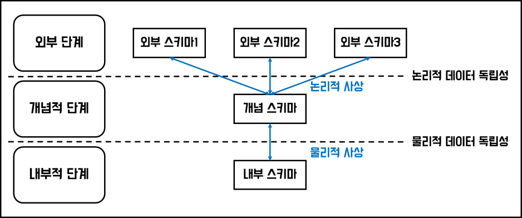
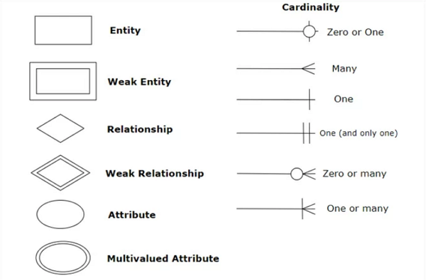

# SQLP

- 2021-12-12 ~ 2022-01-12: Data Modeling

## 목차

1. 데이터 모델링의 이해
   - 데이터 모델링, 엔터티, 속성, 관계, 식별자
   - 성능 데이터 모델링, 정규화, 반정규화, 대량 데이터, DB 구조, 분산DB
2. SQL 기본 및 활용
   - 관계형 DB 개요, DDL, DML, TCL, WHERE 절, 함수, GROUP BY, HAVING, ORDER BY, JOIN
   - 표준 조인, 집합 연산자, 계층형 질의와 셀프 조인, 서브쿼리, 그룹 함수, 윈도우 함수, DCL, 절차형 SQL
   - 옵티마이저와 실행계획, 인덱스 기본, 조인 수행 원리
3. SQL 고급 활용 및 튜닝
   - 데이터베이스 아키텍처, SQL 파싱 부하, 데이터베이스 I/O 원리, 데이터베이스 Call과 네트워크 부하
   - Lock과 트렌잭션 동시성제어
   - SQL 옵티마이저 원리와 쿼리변환
   - 인덱스 기본 원리, 튜닝, 조인 기본 원리, 고급 조인 기법
   - 고급 SQL 활용, 소스 튜닝, DML 튜닝, 파티션 활용, 배치 프로그램 튜닝

## 1️⃣ 데이터 모델링의 이해

### 1-1. 데이터 모델링

- 공식링크 -> [데이터 모델의 이해](https://dataonair.or.kr/db-tech-reference/d-guide/sql/?pageid=5&mod=document&uid=330)

🙂 **데이터 모델링**이란?

- 현실세계를 단순화하여 **데이터 모델로 표현**하자~
- IT System 구축을 위한 **데이터 관점의 업무 분석 기법**

🙄 데이터 모델링이 필요한 이유는?

- **데이터베이스**를 생성, 개발 및 관리하려고!~
- **분석된 모델**(데이터 구조)을 바탕으로 모델링
- 업무에 대한 설명은 **그 자체(데이터)로 설명**하기 쉽게!

😜 현실세계를 모델로 만들려면 어떤 특징이 있나요?

- **추상화**: **일정한 표기법**에 맞춰 표현함
- **단순화**: **제한된 표기법**이나 언어로 표현함
- **정확화**: 애매모호x, **이해하기 쉽게** 표현

😛 그래서 데이터 모델링은 어떻게 해요?

- 모델링의 3가지 관점
  - 데이터 관점(Data, What)
  - 프로세스관점(Process, How)
  - 상관관점(Data vs Process)

- 데이터 모델링의 3단계로 하면 편해요
  - **개념적**(계획): 주제 영역 정의, 엔터티 후보 식별, 핵심 엔터티 정의, 엔터티와 속성을 도출, **ERD를 작성**, 업무중심적, 포괄적인 수준으로 진행
  - **논리적**(분석): ID를 도출, 속성과 관계 정의, **정규화**(데이터 모델의 독립성과 재사용성 확보), 이력관리 정의
  - **물리적**(설계): **DB 구축**, 성능 및 보안 등 물리적인 성격 고려

- 데이터 모델링의 3요소
  - **어떤 것(Thing)**: **엔터티(Entity)**, **인스턴스(Instance)=어커런스(Occurence)**
  - **관계(Relationship)**: UML에 클래스다이어그램 관계 중 연관관계, 의존관계가 있음
  - **속성(Attribute)**: 의미상 더 이상 분리되지 않는 최소의 **데이터 단위**

😝 잘된 데이터 모델링이란?

- **완전성**: 업무에 필요한 **모든 데이터**가 모델에 **정의**
- **중복배제**: 하나의 DB내에 **동일한 사실은 한번만**
- **업무규칙**: **많은 규칙을 사용자가 공유**하도록 제공
- **데이터 재사용**: 데이터가 **독립적**으로 설계해야 함
- **의사소통**: 업무규칙은 엔터티, 서브타입, 속성, 관계 등 형태로 **자세히 표현**
- **통합성**: 동일한 데이터는 **한 번만 정의**, 참조 활용

😏 데이터 모델링 할때 조심해야 하는 점!

- **중복(Duplication)**
  - 같은 정보를 **여러번 저장하지 않게 하기**
  - 예) 회원 이름이 주문, 회원정보 Table 여러 곳에 ㄴㄴ
- **비유연성(Inflexbility)**
  - **데이터 사용과 프로세스를 분리**하여 유연성을 높이기
  - 예) 데이터가 프로세스에 종속적이여서 빈번한 모델에 대한 수정/변경 ㄴㄴ
- **비일관성(Inconsistency)**
  - **상호 연관관계를 명확하게 정의해 일관성 있게** 데이터 유지하기
  - 예) 회원 삭제했는데 카드정보 남아있는거 ㄴㄴ

### 1-1-1+. ANSI-SPARC 3level database architecture

- 참고링크1 -> [데이터베이스-스키마의-개념-특징](https://ykcb.tistory.com/entry/데이터베이스-스키마의-개념-특징)
- 참고링크2 -> [데이터베이스-외부/개념/내부스키마](https://prinha.tistory.com/entry/DB-3단계-데이터베이스-시스템-외부개념내부스키마)

🙂 ANSI/SPARC 에서 정의한 **3단계 데이터베이스 구조**가 뭔가요?

- DBMS 설계를 쉽게 위해 만든 아키텍처
- **외부(external)**, **개념(conceptual)**, **내부(internal)** 스키마로 나눔

  

🙄 **스키마**는 뭔가요?

- 데이터베이스의 구조와 제약 조건에 관한 **전반적인 명세를 기술한 메타데이터의 집합**
- DB를 구성하는 데이터 개체, 속성, 관계 및 데이터 조작 시 제약 조건 등을 전반적으로 정의

🙄 왜 3단계 구조로 나누었나요?

- 데이터모델링에서 중요한 **독립성**을 확보
  - 논리적 독립성
    - 응용 인터페이스(앱, 웹)를 독립성 유지
    - 논리적 구조가 변경되도 응용 프로그램에 영향 없음
    - 개념 스키마가변경되도 외부 스키마에 영향을 미치지 않음
  - 물리적 독립성
    - 저장 인터페이스(DB)를 독립성 유지
    - 내부 스키마가 변경되어도 외부/개념 스키마는 영향을 받지 않음
- 상호간 영향을 벗어나고 고유한 기능을 제공, 기능을 극대화
- 매핑(Mapping): 경계에는 상호 독립적인 개념을 연결시켜줌
  - 논리적 사상
    - 외부적 뷰와 개념적 뷰를 상호 관련성을 정의함

😜 스키마별 특징

- **외부스키마**
  - 개인의 입장, 사용자 뷰를 가르킴
  - 하나의 외부스키마는 여렷이 공유 가능
  - 하나의 DB시스템에 여러 외부스키마 존재 가능
  - `서브스키마(Sub Schema)`라고도 함
- **개념스키마**
  - 개체간 관계와 제약조건을 나타냄, 명세를 정의
  - DBA(데이터베이스 관리자)의 관점에서 바라보는 스키마
  - 단순히 `스키마(Schema)`라고도 함
- **내부스키마**
  - 시스템 설계자나 시스템 프로그래머의 관점에서 바라보는 스키마
  - `저장스키마(Storage Schema)`라고도 함

### 1-1-2. 엔터티(Entity)

- 공식링크 -> [엔터티](https://dataonair.or.kr/db-tech-reference/d-guide/sql/?pageid=5&mod=document&uid=326)

🙂 엔터티란 무엇인가요?

- **데이터의 집합**
  - 예) 학생들을 관리하려면 학생엔터티를 정의함
  - 예) 수학, 영어, 국어는 과목엔터티를 정의하고 포함함
- 저장되고 관리되어야하는 데이터의 어떤 것(Thing)
  - 엔터티는 인스턴스의 집합
- 개념, 장소, 사건 등이나 유형 또는 무형의 대상을 가르킴

🙄 엔터티를 왜 사용하나요?

- 예) 수학, 영어, 국어 등을 하나의 집합으로 관리하면 편리하기 때문!
- 업무에 필요하고 유용한 정보를 저장하고 관리하기 위한 **집합을 구성하기 위해**

🙂 **인스턴스**란 무엇인가요?

- **앤터티를 구성하는 요소들**
  - 예) 회사엔터티 -> 삼성, LG, 카카오 등이 있음
- 엔티티는 인스턴스의 집합

😛 엔터티는 어떻게 이름을 짓나요?

1. 현업에서 사용하는 용어 사용
2. 약어 사용 ㄴㄴ
3. 단수명사
4. 유일한 이름을 지으셈
5. 엔터티 생성의미대로 이름 붙임

😜 엔터티의 특징은 뭔가요?

1. 반드시 해당 업무에서 필요하고 관리하고자 하는 정보여야 함
   - 예) 환자는 병원시스템에서만 사용하면됨, A회사 인사시스템에서 사용할 필요 없음
2. 유일한 식별자에 의해 식별이 가능
   - 환자정보를 찾는데 여러명 찾아짐 ㄴㄴ
3. 영속적으로 존재하는 2개 이상의 인스턴스의 집합이여야 함
   - 회사(엔터티) -> LG CNS(인스턴스) 하나? 집합으로 성립이 안됨
4. 업무프로세스에 의해 이용
   - 필요없는 엔터티 생성 ㄴㄴ
5. 반드시 속성이 있어야 함
   - 속성이 없는 엔터티는 존재하지 않음
   - 날씨 엔터티에 아무 속성이 없을 수 없음
6. 다른 엔터티와 최소 한개 이상의 관계가 있어야 함
   - 관계없는 엔터티는 부적절한 엔터티일 가능성이 큼
   - 아닌경우
     - 통계를 위한 엔터티, 코드를 위한 엔터티, 내부 필요 엔터티는 모델링에서 관계를 생략하거나 없기도 함

😝 엔티티는 어떻게 만들고 분류하나요?

- 발생시점에 따른 분류
  - **키엔터티(Key), 기본엔터티(Fundamental)**
    - 업무에 원래 존재하는 정보, 독립적으로 생성 가능
    - 다른 엔터티로부터 주식별자를 상속받지 않고 고유한 주식별자를 갖음
    - 예) 사원, 부서, 고객, 상품
  - **중심엔터티(Main)**
    - 기본엔터티로부터 발생, 업무에 중심적인 역할
    - 데이터 양이 많이 발생, 다른 엔터티와 관계를 통해 행위엔터티를 생성
    - 예) 계약, 사고, 예금원장, 청구, 주문, 매출
  - **행위엔터티(Active)**
    - 두 개 이상의 부모엔터티로부터 발생, 자주 내용이 바뀌거나 데이터량이 증가
    - 분석초기 단계에서는 잘 나타나지 않으며 상세설계 단계나 프로세스 상관모델링을 진행하며 도출
    - 예) 주문목록, 사원변경이력

- 유무형에 따른 분류
  - **유형 엔터티(Tangible)**
    - 물리적 형태가 있고 지속적인 엔터티
    - 예) 사원, 물품, 학생
  - **개념 엔터티(Conceptual)**
    - 관리해야 할 개념적 엔터티
    - 예) 조직, 상품, 학과
  - **사건 엔터티(Event)**
    - 업무 수행에 따라 발생하는 엔터티
    - 예) 주문, 청구, 휴학

### 1-1-3. 속성(Attribute)

🙂 속성이 뭐에요?

- DB에서 칼럼 하나하나라고 생각하기
- 정확히는 **엔터티가 가지는 항목**
- 더이상 분리되지 않는 단위, 업무에 필요한 데이터를 저장할 수 있음
- 인스턴스의 구성요소이고 의미적으로 더이상 분해되지 않음

🙄 엔터티, 인스턴스, 속성, 속성값의 대한 내용과 표기법

- DB의 테이블(엔터티)은 2개 이상의 행(인스턴스)과 2개 이상의 열(속성)을 가짐
- 엔터티는 2개 이상의 인스턴스 존재
- 각 엔터티에는 고유의 성격을 표현하는 속성정보 2개를 가짐
- 하나의 속성은 하나의 속성값을 가짐

😛 속성의 특징

- 해당 업무에서 필요하고 관리하고자 하는 정보
- 정해진 주식별자에 함수적 종속성을 가져야 함
- 하나의 속성에는 한 개의 값만을 가짐

😜 속성의 분류

1. 속성의 특성에 따른 분류
   - 기본속성(Basic Attribute)
     - 다른 속성의 영향을 받지않는 엔터티 고유의 성격을 나타내는 것
     - 예) 원금, 예치기간
   - 설계속성(Desigend Attribute)
     - 식별자처럼 데이터 모델링을 위한 속성
     - 예) 예금분류(01-일반예금, 02-특별예금), 상품코드
   - 파생속성(Derived Attribute)
     - 다른 속성의 영향을 받아 계산된 결괏값
     - 예) 이자(이자율에 의해 계산됨)
2. 엔터티 구성방식에 따른 분류
   - 식별할 수 있는 속성(PK), 관계에 포함된 속성(FK), 나머지인 일반속성
     - 예) PK(사원번호), FK(부서코드), 일반속성(사원명, 전화번호)
   - 단순속성(Simple), 복합속성(Composite)
     - 예) 주소(복합: 시, 구, 동), 성별(단순)
   - 단일값속성(Single-Valued), 다중값속성(Multi-Valued)
     - 예) 주민번호(무조건 1개), 소셜미디어(여러개 가능)
     - 다중값속성의 경우 1차 정규화나 변도의 엔터티를 만들어 관계로 연결

😝 속성 명명법

- C/S, Web, Interface에 나타나기 때문에 업무와 직결되는 항목이라 정확하고 혼란없이 만들기
- 해당업무에서 사용하는 이름을 부여
- 서술식 속성명은 사용하지 않음
- 약어사용은 가급적 제한
- 전체 데이터모델에서 유일성 확보하는 것이 좋음

😏 도메인이란?

- 속성에 대한 데이터타입, 범위, 제약사항 지정
- 예) 성별은 남여만 정의, 출생년도는 1900~현재까지만 정의

### 1-1-4. 관계(Relationship)

- 공식링크 -> [관계](https://dataonair.or.kr/db-tech-reference/d-guide/sql/?pageid=5&mod=document&uid=328)

1. 🙂 관계란?

   - 엔터티의 인스턴스 사이의 논리적인 연관성으로 존재나 행위로서 연관성이 부여된 상태
   - 예) 강사와 수강생의 관계, 고객과 주문의 관계
   - 패어링(Paring): 엔터티 안에 인스턴스가 개별적으로 관계를 가지는 것

2. 🙄 관계의 분류

   - 존재에 의한 관계: 사원은 부서에 항상 속해있음
   - 행위에 의한 관계: 주문은 고객이 주문을 할 때 발생됨

3. 😛 관계의 표기법

   - 관계명(Membership)
     - 동사형으로 지을 것 예) 포함한다, 소속된다
     - 애매한 동사를 피하고 현재형으로 표현
   - 관계차수(Cardinality/Degree)
     - Crow’s Foot 모델에서는 선을 이용하여 표현
     - 1:1: 사원, 병역사항
     - 1:M: 부서, 사원
     - M:M: 주문, 제품
   - 관계선택사양(Optionality)
     - 필수관계(Mandatory): 지하철 출발하려면 문이 반드시 닫혀야 함
     - 선택관계(Optional): 지하철 초록불은 출발을 알리는 것

4. 😜 엔티티 사이에서 관계를 도출할 때 체크할 사항들은?

   - 두 개의 엔터티 사이에 관심있는 연관규칙이 존재하는가?
   - 두 개의 엔터티 사이에 정보의 조합이 발생되는가?
   - 업무기술서, 장표에 관계연결에 대한 규칙이 서술되어 있는가?
   - 업무기술서, 장표에 관계연결을 가능하게 하는 동사가 있는가?

   관계 읽기

   - 기준(Source)엔터티를 한 개(One) 또는 각(Each)로 읽는다.
   - 대상(Target)엔터티의 관계참여도 즉 개수(하나, 하나 이상)를 읽는다.
   - 관계선택사양과 관계명을 읽는다.
   - 예) 각각의 사원은 한 부서에 때때로 속한다.
   - 예) 각 부서에는 여러 사원이 항상 소속된다.

### 1-1-5. 식별자(Identifier)

- 공식링크 -> [식별자](https://dataonair.or.kr/db-tech-reference/d-guide/sql/?pageid=5&mod=document&uid=329)

1. 식별자란 무엇인가요?

   - 게임의 ID가 식별자임
   - 엔터티는 인스턴스의 집합, 이 중에 **각각을 구분할 수 있는 논리적 이름**이 있어야 함 이를 식별자라고 함

2. 식별자의 특징

   - 유일성
     - 주식별자에 의해 엔터티내에 모든 인스턴스들을 유일하게 구분함
     - 예) 학번, 사원번호의 중복ㄴㄴ
   - 최소성
     - 주식별자를 구성하는 속성의 수는 유일성을 만족하는 최소의 주가 되야 함
     - 예) 학과코드 + 학번로 식별자로 ㄴㄴ, 그냥 학번으로만 하셈
   - 불변성
     - 예) 한번 정해진 학번 변경 ㄴㄴ해, 만약 바꾸려면 퇴학하고 재입학하셈
   - 존재성
     - 주식별자가 지정되면 반드시 데이터 값이 존재, Null값은 안됨
     - 입학했는데 학번 없을 수 없음

3. 식별자의 종류

   - 주식별자(Primary ID)와 보조식별자(Alternate ID)
     - 엔터티 내에서 대표성을 가지면 주식별자, 나머지는 보조식별자
     - 예) 사원번호(주), 주민번호(보조)
   - 내부식별자와 외부식별자(Foreign ID)
     - 엔터티 내에서 스스로 생성 여부
     - 예) 회원번호(내부), 주문번호(외부)
   - 단일식별자(Single ID)와 복합식별자(Composit ID)
     - 단일 속성으로 식별이 가능한지
     - 예) 사번(단일), 주문번호+상품코드(복합)
   - 본질식별자와 인조식별자
     - 업무에 의해 만들어지는 식별자, 인위적으로 만든 식별자
     - 예) 주민번호(본질), 사원번호(인조)

4. 식별자의 도출 기준

   1. 업무에서 자주 이용되는 속성을 주식별자로 지정
      - 예) 직원은 사번(주식별자), 주민번호(보조식별자)로 함
   2. 명칭, 내역 등과 같이 이름으로 기술되는 것들은 가능하면 주식별자로 사용하지 않음
      - 예) 부서이름이 100개 있으면 부서이름은 유일하게 구별될 수 있다고 하여 부서이름을 주식별자로 지정하지 않아야 함, 주식별자를 부서이름을 할 경우 항상 부서이름이 WHERE 조건절에 기술되는 현상 발생, 부서이름은 20자 이상 될 수도 있어 속도 저하
      - 따라서 명칭이나 내역이 있고 다른 구분자가 존재하지 않을 경우 새로운 식별자를 생성함: 일련번호, 코드 등
   3. 복합으로 주식별자로 구성할 경우 너무 많은 속성이 포함되지 않도록 함
      - 예) 접수일자+관할부서+입력자사번+접수방법코드+...을 접수번호로 하나로 만들어 관리를 편하게 함

5. 식별자관계와 비식별자관계에 따른 식별자

   - 식별자관계와 비식별자 관계 결정
     - 외부식별자(Foreign Identifier)는 다른 엔터티와의 관계를 통해 자식쪽에 엔터티에 생성되는 속성을 외부식별자라 하며 DB 생성 시 Foreign Key 역할을 함
   - 식별자관계
   - 비식별자관계
   - 식별자 관계로만 설정할 경우의 문제점
   - 비식별자 관계로만 설정할 경우의 문제점
   - ㅇㅇ

### 1-1-5+. ERD(Entity Relationship Diagram)

- 참고링크1 -> [IE 표기법과 BARKER 표기법](https://mjn5027.tistory.com/42)
- 공식링크 -> [데이터베이스 구조와 성능](https://dataonair.or.kr/db-tech-reference/d-guide/sql/?pageid=5&mod=document&uid=335)

1. 🙂 ERD는 뭔가요?

   - 개체(엔터티)간의 관계를 다이어그램으로 그려보자!
   - 개체-관계 모델, 1976년 피터첸이 Entity Relationship Model 개발

     

2. 🙄 ERD를 왜 그리나요?

   - 기존 **데이터 관계를 파악**
   - 개발 중 기능구현에도 **모델을 한눈에 보기 위해** 유용하게 사용될 수 있으므로 참조용

3. 😛 작성 순서는 어떻게 되나요?

   1. 엔터티를 그린다.
   2. 엔터티를 적절하게 배치한다.
   3. 엔터티간 관계를 설정한다.
   4. 관계명을 기술한다.
   5. 관계의 참여도를 기술한다.
   6. 관계의 필수여부를 기술한다.

4. 😜 ERD와 UML의 차이

   - ERD는 존재적 관계와 행위에 의한 관계를 구분x
   - UML 클래스다이어그램에서는 관계를 구분
     - 의존(Dependency)관계: 점선(Option), 내가 있기 때문에 너가 있어!
     - 연관(Association)관계: 필수(Required), 소속된다!

### 1-6. 성능 데이터 모델링의 개요

- 공식링크 -> [성능 데이터 모델링의 개요](https://dataonair.or.kr/db-tech-reference/d-guide/sql/?pageid=5&mod=document&uid=331)

1. 🙂 성능 데이터 모델링의 정의

   모델링 때부터 정규화, 반정규화, 테이블통합, 테이블분할, 조인구조, PK, FK 등 여러 가지 성능과 관련된 사항이 데이터 모델링에 반영될 수 있도록 하는 것

2. 🙄 왜 성능 데이터 모델링을 하나요?

   - 사전에 해야 재업무(Rework) 최소화, 나중에 성능개선시 비용 증가

3. 성능 데이터 모델링 고려사항

   - 정규화를 정확하게 수행
   - 데이터베이스 용량산정
   - 트랜잭션의 유형 파악
   - 용량과 트랜잭션의 유형에 따라 반정규화
   - 이력모델의 조정, PK/FK조정, 슈퍼타입/서브타입 조정 등
   - 성능관점에서 데이터 모델을 검증

### 1-7. 정규화와 성능

### 1-8. 반정규화와 성능

### 1-9. 대량 데이터에 따른 성능

1. 대량 데이터발생에 따른 테이블 분할의 필요

   - 성능저하 때문에 데이터 분할 하셈
   - 예로 고속도로가 넓다고 좋은건 아님
   - 인덱스 트리가 너무 커져 디스크 I/O를 많이 유발

### 1-10. 데이터베이스 구조와 성능

### 1-11. 분산 데이터베이스와 성능

## 2️⃣ SQL 기본 및 활용

## 3️⃣ SQL 고급활용 및 튜닝

🙂 무엇?(정의)
🙄 왜?(사용이유)
😛 어떻게?(사용방법)
😜 특징1
😝 특징2
😏 특징3
