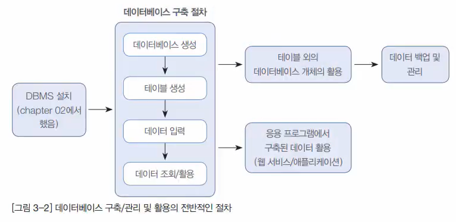

# Chapter 03 MySQL 설치

## 03-01 데이터베이스 필수 용어

## 용어

|  파일 시스템   | 데이터베이스 모델링 |     관계형 데이터베이스     |
| :------------: | :-----------------: | :-------------------------: |
|   파일(file)   |   엔터티(Entity)    |        테이블(table)        |
|  필드(field)   |   속성(attribute)   |        컬럼(column)         |
| 레코드(record) |     튜플(Tuple)     |           행(row)           |
|    키(key)     | 유일값(identifier)  | 기본키(Primary key), unique |

위의 몇가지 경우 혼용해서 사용하기도 함

### 요구사항 분석, 시스템 설계, 모델링

DBMS(MySQL) -> Table -> Data(row)

## 03-02 데이터베이스 구축 절차 실습

### 구축 절차



### 구축

테이블 생성: memberTbl, ProductTbl

```sql
CREATE TABLE `shopdb`.`membertbl` (
  `memberID` CHAR(8) NOT NULL,
  `memberName` CHAR(5) NOT NULL,
  `memberAddress` CHAR(20) NULL,
  PRIMARY KEY (`memberID`));

CREATE TABLE `shopdb`.`producttbl` (
    `productName` CHAR(4) NOT NULL,
    `cost` INT NOT NULL,
    `makeDate` DATE NULL,
    `company` CHAR(5) NULL,
    `amount` INT NOT NULL,
PRIMARY KEY (`productName`));
```

값 넣기

```sql
INSERT INTO `shopdb`.`membertbl` (`memberID`, `memberName`, `memberAddress`) VALUES('Dang', '당탕이', '경기도 부천시 중동');
INSERT INTO `shopdb`.`membertbl` (`memberID`, `memberName`, `memberAddress`) VALUES('Jae', '지운이', '서울 은평구 증산동');
INSERT INTO `shopdb`.`membertbl` (`memberID`, `memberName`, `memberAddress`) VALUES('Han', '한주연', '인천 남구 주안동');
INSERT INTO `shopdb`.`membertbl` (`memberID`, `memberName`, `memberAddress`) VALUES('Sang', '상달이', '경기도 성남시 분당구');
INSERT INTO `shopdb`.`membertbl` (`memberID`, `memberName`, `memberAddress`) VALUES('Ezreal', '완상이', '경기도 김포시 걸포동');

INSERT INTO `shopdb`.`producttbl` (`productName`, `cost`, `makeDate`, `company`, `amount`) VALUES ('컴퓨터', '200', '2020-1-1', '삼성', '17');
INSERT INTO `shopdb`.`producttbl` (`productName`, `cost`, `makeDate`, `company`, `amount`) VALUES ('세탁기', '120', '2020-12-25', 'LG', '3');
INSERT INTO `shopdb`.`producttbl` (`productName`, `cost`, `makeDate`, `company`, `amount`) VALUES ('냉장고', '145', '2020-3-5', '대우', '22');
```

## 03-03 데이터베이스 개체 - 인덱스

### 인덱스란

책 뒤에 찾아보기같은 개념, 빠르게 찾을 수 있음

index를 만들면 굉장히 빠르게 Data를 불러옴

```sql
-- 테이블 생성
CREATE TABLE shopdb.indexTBL (
    first_name VARCHAR(14),
    last_name VARCHAR(16),
    hire_date DATE
);

-- 테이블에 다른 D(employees)B의 다른 테이블(employees)의 성, 이름, 고용일 500개만 추가
INSERT INTO shopdb.indexTBL
  SELECT first_name, last_name, hire_date
  FROM employees.employees
  LIMIT 500;

SELECT * FROM indexTBL;
SELECT * FROM shopdb.indexTBL WHERE first_name = 'Mary';

-- INDEX 를 생성하면 빠르게 불러올 수 있다!
CREATE INDEX idx_indexTBL_firstname ON shopdb.indexTBL(first_name);
SELECT * FROM shopdb.indexTBL WHERE first_name = 'Mary';
```

## 03-04 데이터베이스 개체 - 뷰, 저장프로시저, 트리거

### 뷰(View)

뷰 특징

- 가상 테이블, 진짜 테이블에 링크된 개념
- 뷰를 사용하면 데이터 보안과 안정성이 좋음(읽기 전용의 특징을 잘 살림)

뷰 생성

```sql
USE shopdb;
-- View 생성
CREATE VIEW uv_memberTBL
AS SELECT memberName, memberAddress FROM memberTBL;
-- View 조회
SELECT * FROM uv_memberTBL;
```

### 저장 프로시저(Stored Procedure)

개념: MySQL에서 제공해주는 **프로그래밍 기능**

```sql
-- 저장 프로시저 정의
DELIMITER //
CREATE PROCEDURE myProc()
BEGIN
    SELECT * FROM memberTBL WHERE memberName = '당탕이';
    SELECT * FROM productTBL WHERE productName = '냉장고';
END //

-- 실행
CALL myProc();
```

### 트리거(Trigger)

- 개념: 테이블에 부착되어 테이블에 특정 작업이 발생되면 실행되는 코드
- 예시: 회원Table의 회원 삭제 -> 트리거 발동 -> 삭제Table에 저장

```sql
-- 삭제 테이블 생성
CREATE TABLE deletedMemberTBL(
    memberID char(8),
    memberName char(5),
    memberAddress char(20),
    deleteDate date -- 삭제 날짜
);

-- TRIGGER 생성
DELIMITER //
CREATE TRIGGER trg_deletedMemberTBL  -- 트리거 이름
    AFTER DELETE  -- 삭제 후에 작동
    ON memberTBL  -- 트리거를 부착할 테이블
    FOR EACH ROW  -- 각 행마다 실행
BEGIN
    -- OLD 테이블의 내용을 백업테이블에 삽입
    INSERT INTO deletedMemberTBL
    VALUES (OLD.memberID, OLD.memberName, OLD.memberAddress, CURDATE());
END //

USE shopdb;
SELECT * FROM memberTBL;
DELETE FROM memberTBL WHERE memberName = '당탕이';
-- ERROR: 1175 Safe Update 가 뜬다면 안전하게(킷값으로만) 삭제 업데이트 설정이 켜져있어서임
-- Edit -> Preferences -> SQL Editor -> Safe Updates(가장 아래) 체크 해제

SELECT * FROM memberTBL;
SELECT * FROM deletedMemberTBL;

-- TRIGGER 삭제
DROP TRIGGER trg_deletedMemberTBL
```

## 03-05 백업과 복원

DB관리자(DBA: Database Administrator)가 필수로 해야할 일!

### 백업

workbench에 -> `Administration` -> `Data Export` -> `해당 DB` 클릭 -> `해당 TABLE` 클릭 -> Export to Self-Contained File 에 폴더 선택

옵션 클릭: `Create Dump in a Single Transaction(self-contained file)`, `Include Create Schema`

### 복원

```sql
USE sys; 
```

workbench에 -> `Administration` -> `Data Import` -> `해당 경로` 클릭 -> Target은 원하는 테이블DB로 설정 -> `Start Import`

## 03-06 MySQL과 응용프로그램 연동

1. ODBC(Open Database Connectivity) 에서 연결하기(**32bit로 접속!!**)

    cmd 창에서 아래 입력 후 -> 시스템 DSN(Data Source Name) -> MySQL ODBC 8.0 Unicode Driver -> 127.0.0.1/3306

    ```powershell
    c:\Windows\SysWOW64\odbcad32.exe  # 32bit 로 접속
    odbcad32  # 참고로 64bit로 접속 (32bit에서 설정하기)
    ```

2. 외부 프로그램에 접속 후 DB 연결

    기본 원리는 C#의 ASP.NET에서 DB연결 후 테이블 생성해서 DB와 연동

    접속 과정은 youtube에 자세히 있음
